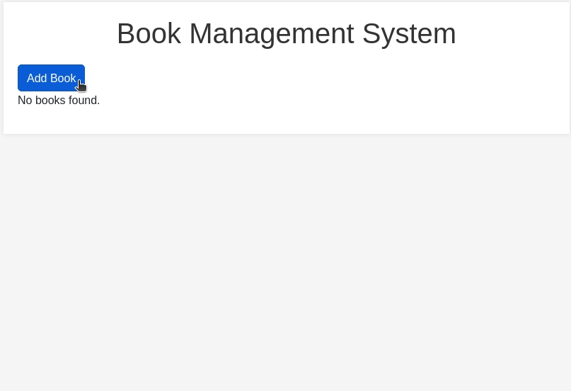

# Book Management System

## Description

The Book Management System is a web-based application that allows users to manage their collection of books. Users can add new books, edit existing ones, and delete books they no longer need. The application uses Flask for the backend and SQLite for the database to store book records.

## How it Works

- The program starts by importing the necessary modules and libraries (<code>Flask</code>, <code>SQLAlchemy</code>, <code>os</code>).

- Then the Flask application is set up, including configuration for the database and creating an instance of the SQLAlchemy database.

- The <code>Book</code> class is created to represent the model for books in the database, including attributes like <code>title</code>, <code>author</code>, <code>description</code>, and <code>rating</code>.

- The SQLite database is created and the necessary table for books is defined.

- Various routes are established to handle different functionalities:
    - <strong>Index Route</strong> (<code>/</code>): Displays the list of book.
    - <strong>Add Book Route</strong> (<code>/add_book</code>): Allows the user to add a new book.
    - <strong>Edit Book Route</strong> (<code>/edit_book/int:book_id</code>): Allows the user to edit an existing book.
    - <strong>Delete Book Route</strong> (<code>/delete_book/int:book_id</code>): Allows the user to delete an existing book.

- The routes render HTML templates that serve as the views, providing the user interface for the corresponding functionality. Users can interact with the application by filling out forms to add or edit book details.

## How to Run the Program

- To run this application, first you must ensure that you have Python installed on your system.

- Ensure that you have <code>Flask</code> and <code>SQLAlchemy</code> installed on your system. If not, you can install them using pip:

<pre>pip install flask flask_sqlalchemy</pre>

- Navigate to the project directory.
- Run the application on the terminal:
<pre>python3 app.py</pre>

- Open a web browser and go to http://localhost:5000 to access the Book Management System. The output will look like this:

  

