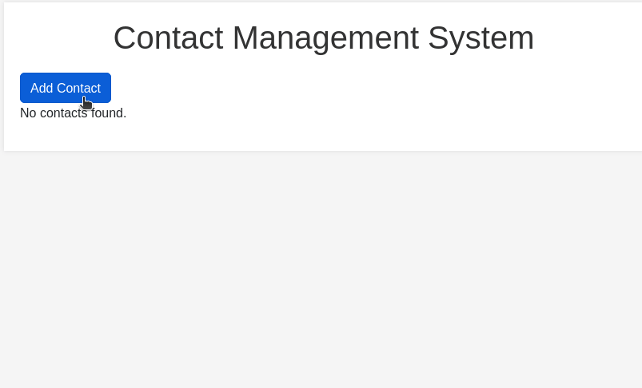

# Contact Manager

## Description

The Contact Manager is a simple web application that allows users to manage their contacts. Users can view a list of contacts, add new contacts, edit existing contacts, and delete contacts. The application uses Flask for the backend and SQLite for the database to store contact information.

This web application is an implementation of this [Simple Address Book CLI](https://github.com/joj-macho/Pythological-Playground/tree/main/converter), providing a more user-friendly interface for managing contacts.

## How it Works

- The program starts by importing the necessary modules and libraries (<code>Flask</code>, <code>SQLAlchemy</code>, <code>os</code>).

- Then the Flask application is set up, including configuration for the database and creating an instance of the SQLAlchemy database.

- The <code>Contact</code> class is defined, representing the model of a contact with attributes like <code>name</code>, <code>phone</code>, and <code>email</code>.

- The program then creates the SQLite database and the necessary table for contacts.

- The program then creates various routes for different functionalities, these routes act as the controller, handling the interactions between the user and the model:
    - <strong>Index Route</strong> (<code>/</code>): Displays the list of contacts.
    - <strong>Add Contact Route</strong> (<code>/add_contact</code>): Allows the user to add a new contact.
    - <strong>Edit Contact Route</strong> (<code>/edit_contact/int:contact_id</code>): Allows the user to edit an existing contact.
    - <strong>Delete Contact Route</strong> (<code>/delete_contact/int:contact_id</code>): Allows the user to delete an existing contact.

- The routes above render HTML templates that serve as the views, providing the user interface for the corresponding functionality. Users can interact with the application by filling out forms to add or edit contacts.

## How to Run the Program

- To run this application, first you must ensure that you have Python installed on your system.

- Ensure that you have <code>Flask</code> and <code>SQLAlchemy</code> installed on your system. If not, you can install them using pip:

<pre>pip install flask flask_sqlalchemy</pre>

- Go to the project directory.
- Run the application on the terminal:
<pre>python3 app.py</pre>

- Open a web browser and go to http://localhost:5000 to access the Contact Manager. The output will look like this:

  

