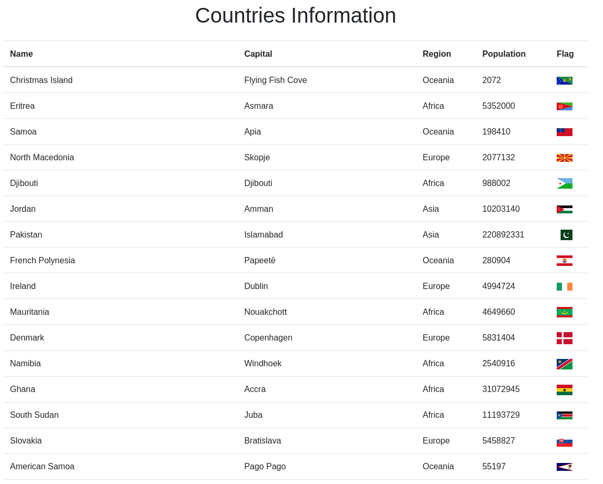

# Country Information Viewer

## Description

The Country Information Viewer is a Flask web application that utilizes the REST Countries API to fetch and display information about all countries.

## How it Works

Various routes for different functionalities:

- The home page is rendered using the `index()` function in `app.py`. This function retrieves country data from the REST Countries API using the `get_countries()` function and then renders the `index.html` template with the obtained country data.

- The `get_countries()` function sends a GET request to the REST Countries API to retrieve information about all countries. It handles exceptions that may occur during the API request and returns a list of country data.

- Make sure to have an active internet connection as the program relies on data from the REST Countries API. If an error occurs during data fetching, appropriate error messages will be displayed.

## Program Input & Output

When you run the program (`app.py`), Flask starts a development server, and you can access the application by visiting `http://127.0.0.1:5000/` in your web browser. The home page will display a list of countries.

The output will look like this:

