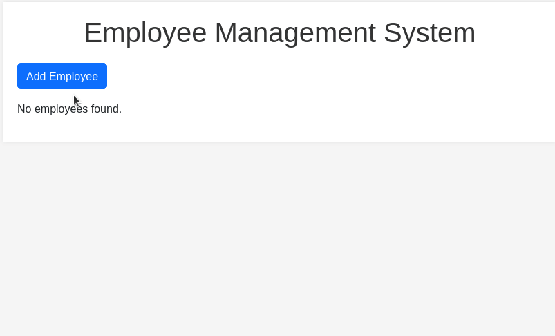

# Employee Manager Application

## Description

The Employee Manager is a web application that allows users to manage employee information. Users can view a list of employees, add new employees, edit existing employee details, and delete employees. The application uses Flask for the backend and SQLite for the database to store employee information.

## How it Works

- Start by setting up the Flask application including importing required modules, configuration for the database and creating an instance of the SQLAlchemy database.

- The `Employee` class is defined, representing the model of an employee with attributes like `name`, `position`, `department`, and `salary`.

- The SQLite database is created and the necessary table for employees is defined.

- Various routes are established to handle different functionalities:
    - **Index Route** (`/`): Displays the list of employees.
    - **Add Employee Route** (`/add_employee`): Allows the user to add a new employees.
    - **Edit Employee Route** (`/edit_employee/int:employee_id`): Allows the user to edit an existing employees.
    - **Delete Employee Route** (`/delete_employee/int:employee_id`): Allows the user to delete an existing employees.

- The routes above render HTML templates that serve as the views, providing the user interface for the corresponding functionality. Users can interact with the application by filling out forms to add or edit employee details.

## How to Run the Program

- To run this application, first you must ensure that you have Python installed on your system.
- Ensure that you have `Flask` and `SQLAlchemy` installed on your system. If not, you can install them using pip: `pip install flask flask_sqlalchemy`
- Go to the project directory.
- Run the application on the terminal: `python3 app.py`
- Open a web browser and go to http://localhost:5000 to access the Employee Manager. The output will look like this:

