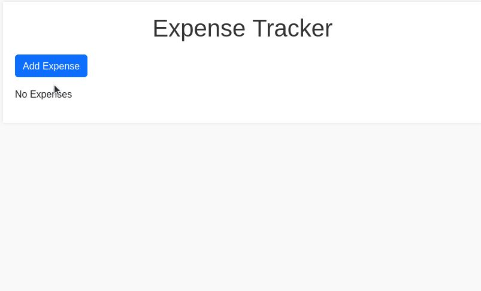

# Expense Tracker Application

## Description

The Expense Tracker Application is a web-based tool that allows users to record and manage their expenses. Users can add new expenses, edit existing ones, and delete expenses they no longer need. The application uses Flask for the backend and SQLite for the database to store expense records, including details like description, amount, date, and category.

## How it Works

- The program starts by importing the necessary modules and libraries (<code>Flask</code>, <code>SQLAlchemy</code>, <code>os</code>).

- Then the Flask application is set up, including configuration for the database and creating an instance of the SQLAlchemy database.

- The <code>Expense</code> class is defined, representing the model of an expense with attributes like <code>description</code>, <code>amount</code>, <code>date</code>, and <code>category</code>.

- The program then creates the SQLite database and the necessary table for expenses.

- The program then creates various routes for different functionalities, these routes act as the controller, handling the interactions between the user and the model:
    - <strong>Index Route</strong> (<code>/</code>): Displays the list of employees.
    - <strong>Add Contact Route</strong> (<code>/add</code>): Allows the user to add a new expense.
    - <strong>Edit Contact Route</strong> (<code>/edit/int:id</code>): Allows the user to edit an existing expense.
    - <strong>Delete Contact Route</strong> (<code>/delete_employee/int:id</code>): Allows the user to delete an existing expense.

- The routes above render HTML templates that serve as the views, providing the user interface for the corresponding functionality. Users can interact with the application by filling out forms to add or edit expense details.

- **Note**: To handle date input in <code>app.py</code>, the date string from the form is converted to a Python date object using <code>datetime.strptime()</code> before storing it in the database.

## How to Run the Program

- To run this application, first you must ensure that you have Python installed on your system.

- Ensure that you have <code>Flask</code> and <code>SQLAlchemy</code> installed on your system. If not, you can install them using pip:

<pre>pip install flask flask_sqlalchemy</pre>

- Go to the project directory.
- Run the application on the terminal:
<pre>python3 app.py</pre>

- Open a web browser and go to http://localhost:5000 to access the Expense Tracker. The output will look like this:

  

