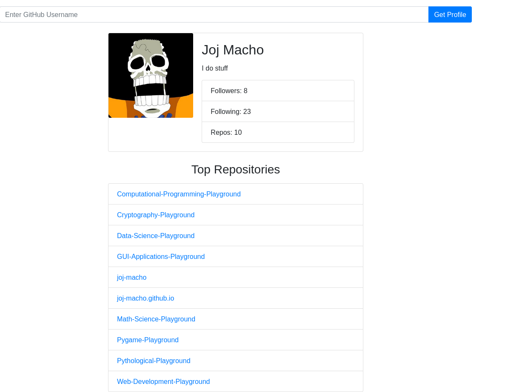

# GitHub Profile Viewer

## Description

The GitHub Profile Viewer is a Flask web application that allows users to search for GitHub profiles using a username. The app fetches data from the GitHub API to display the user's information, including their name, bio, followers, following, and top repositories.

This app is a web-based alternative to the [GitHub Profile Viewer CLI program](https://github.com/joj-macho/Pythological-Playground/tree/main/github-profile-viewer). While the CLI program allows direct interaction through the command line, the Flask app provides a user-friendly interface for exploring GitHub profiles.

## How it Works

- **Homepage**: When you access the application, you'll see a simple homepage.

- **Search for a User**: Enter a GitHub username in the provided form and submit it.

- **User Information**: The app fetches data from the GitHub API for the entered username. If the user is found, it displays the user's profile information, including their name, bio, followers, following, and avatar.

- **Top Repositories**: The app also fetches the user's top repositories (up to 10) and displays them as clickable links.

- **Error Handling**: If the entered username is not found, the app shows an error message. If no username is provided, a warning message is displayed.

## Program Input & Outputs

Run the Flask application with the following command:

```bash
python app.py
```

Visit `http://localhost:5000` in your web browser to access the app.

Enter a GitHub username in the form, and the app will display the user's information. The output will look like this:


