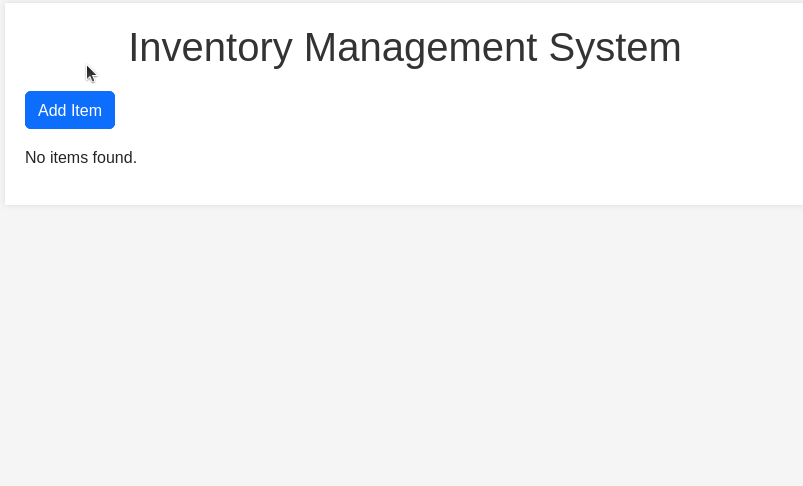

# Inventory Management System Application

## Description

The Inventory Management System is a web application that assists users in efficiently managing their inventory. Users can add new items to the inventory, edit existing items, and remove items they no longer need. The application uses Flask for the backend and SQLite for the database to store inventory records.

## How it Works

- Start by setting up the Flask application including importing required modules, configuration for the database and creating an instance of the SQLAlchemy database.

- The `Item` class is created to represent the model for inventory items, including attributes like `name`, `quantity`, and `price`.

- The SQLite database is created and the necessary table for inventory items is defined.

- Various routes are established to handle different functionalities:
    - **Index Route** (`/`): Displays the list of item.
    - **Add Item Route** (`/add_item`): Allows the user to add a new item.
    - **Edit Item Route** (`/edit_item/int:item_id`): Allows the user to edit an existing item.
    - **Delete Item Route** (`/delete_item/int:item_id`): Allows the user to delete an existing item.

- The routes render HTML templates that serve as the views, providing the user interface for the corresponding functionality. Users can interact with the application by filling out forms to add or edit item details.

## How to Run the Program

- To run this application, first you must ensure that you have Python installed on your system.

- Ensure that you have `Flask` and `SQLAlchemy` installed on your system. If not, you can install them using pip:

`pip install flask flask_sqlalchemy`

- Navigate to the project directory.
- Run the application on the terminal:
`python3 app.py`

- Open a web browser and go to http://localhost:5000 to access the Inventory Management System. The output will look like this:

