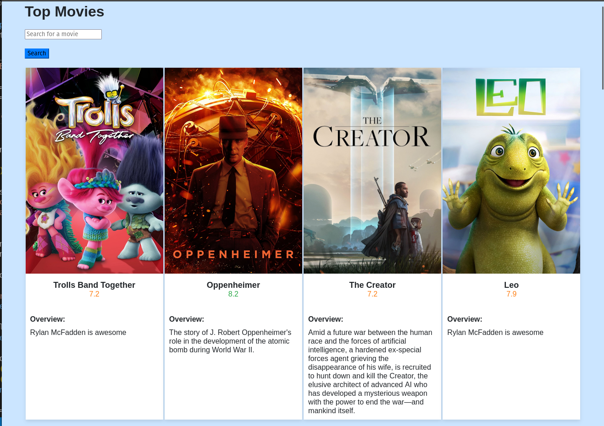
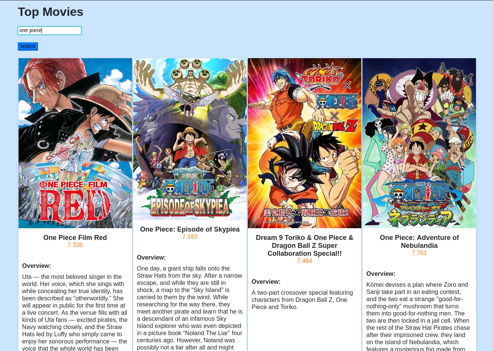

# Movie Application

## Description

The Movie Information Viewer is a Flask application that displays information about top movies. It uses The Movie Database (TMDb) API to fetch movie data, including titles, ratings, and overviews. Users can explore popular movies and search for specific titles.

The movie poster images used in this application are sourced from [The Movie Database (TMDb)](https://www.themoviedb.org/).

## How it Works

- The Flask application is initialized and configured with a secret key.

- Constants for The Movie Database (TMDb) API, such as `API_KEY`, `API_URL`, and `IMG_PATH`, are defined.
    - `API_KEY`: The API key required for accessing TMDb API.
    - `API_URL`: The base URL for TMDb API.
    - `IMG_PATH`: The base URL for retrieving movie poster images.
    - `DISCOVER_API`: The API endpoint for discovering top movies.
    - `SEARCH_API`: The API endpoint for searching movies based on user input.

- Routes are established to handle movie discovery (`/`) and movie search (`/search`). The routes render HTML templates, providing a user interface to interact with the application.
    - `/`: Renders the index page displaying top movies.
    - `/search` (POST): Handles the movie search functionality and renders the index page with search results.

- The `get_movies` function fetches movie data from the provided URL, and the `rate_class` filter determines the CSS class for movie ratings.

## How to Run the Application

- Make sure you have a valid TMDb API key.
- To run this application, make sure you have Python installed on your system.
- Ensure that Flask is installed. If not, you can install it using pip: `pip install flask`
- Navigate to the project directory.
- Run the application in the terminal: `python3 app.py`
- Open a web browser and navigate to `http://127.0.0.1:5000/` to view the top movies.
- Use the search bar to look for specific movies.

The output will look like this:

