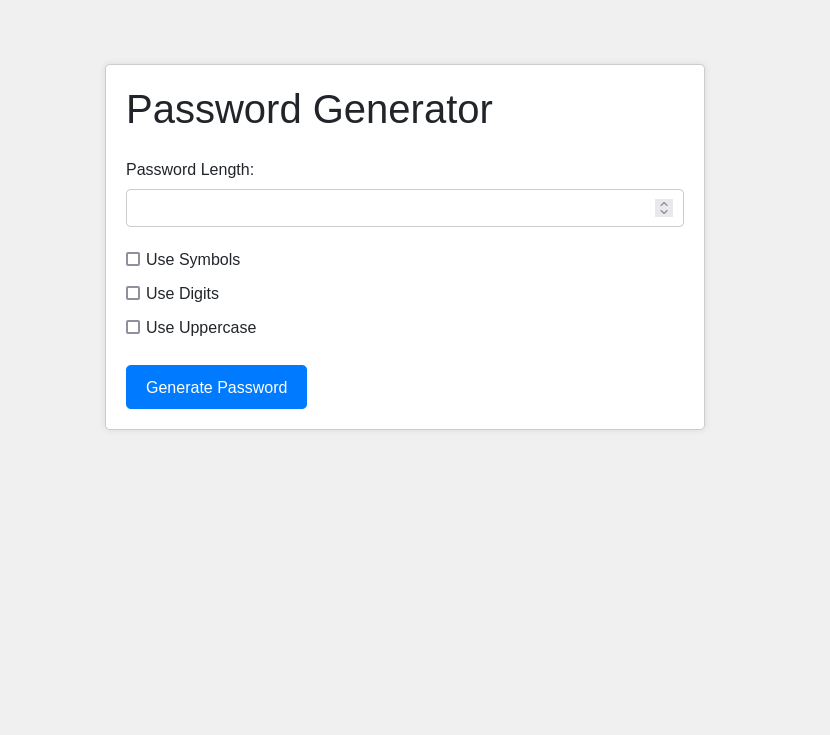

# Password Generator

## Description

The Password Generator is a Flask-based web application that allows users to generate random passwords based on their preferences. Users can specify the password length and choose whether to include symbols, digits, and uppercase letters in the generated password.

This application serves as a web-based counterpart to the [CLI password generator](https://github.com/joj-macho/Pythological-Playground/tree/main/password-generator) program. The CLI version is a simple program that enables users to generate passwords, save them to a JSON file, and search for passwords by website.

## How it Works

- The Flask application is initialized and configured with a secret key.

- The main route (`/`) renders the home page where users can input their preferences for the password.

- The `/generate_password` route handles the form submission, generates a random password using the `secrets` module, and flashes a message for user feedback.

- The Flask web application provides a user-friendly interface where users can input their preferences for password generation. It includes checkboxes for including symbols, digits, and uppercase letters.

## How to Run the Application

- To run this application, make sure you have Python installed on your system.
- Ensure that Flask is installed. If not, you can install it using pip: `pip install flask`
- Navigate to the project directory.
- Run the application in the terminal: `python3 app.py`
- Open a web browser and navigate to `http://127.0.0.1:5000/` to access the Password Generator.
- Use the search bar to look for specific movies.

The output will look like this:

