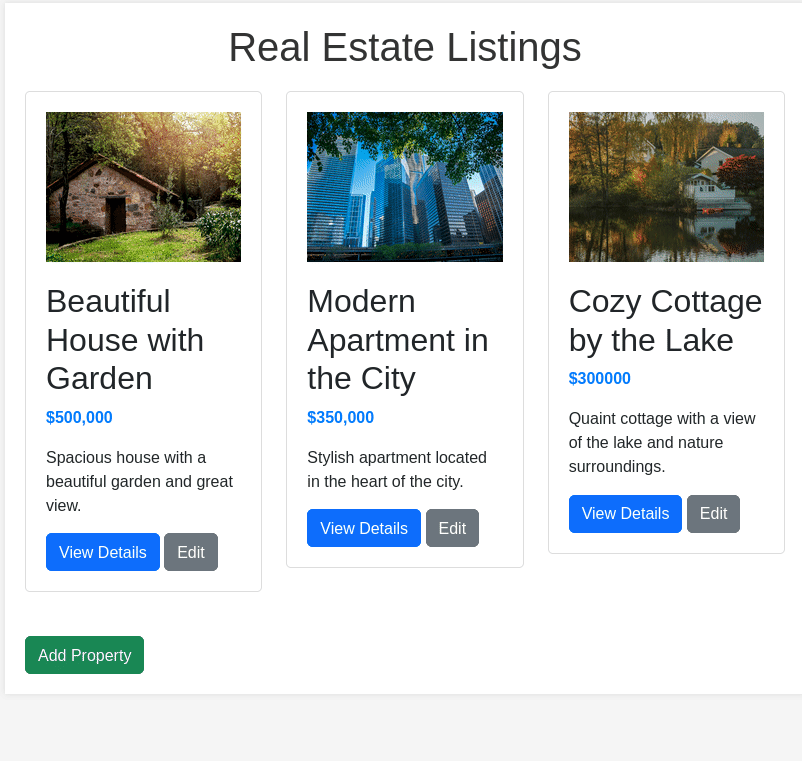

# Real Estate Listings Application

## Description

The Real Estate Listings Application is a web-based tool that allows users to view, add, edit, and delete property listings. It uses Flask for the backend and SQLite for the database to store property records.

## How it Works

- The program starts by importing the necessary modules and libraries (<code>Flask</code>, <code>SQLAlchemy</code>, <code>os</code>).

- The Flask application is initialized, and the necessary configurations, including the secret key and database URI, are set.

- A <code>Property</code> class is defined to represent the model of a property with attributes such as <code>title</code>, <code>description</code>, <code>price</code>, and <code>image_url</code>.

- The program creates the SQLite database and the necessary table for property listings.

- Various routes are defined to handle different functionalities:
    - <strong>Index Route</strong> (<code>/</code>): Displays all property listings.
    - <strong>Propery Route</strong> (<code>/property/int:property_id</code>): Displays a specific property listing.
    - <strong>Add Listing Route</strong> (<code>/add_property</code>): Allows the user to add a new property.
    - <strong>Edit Listing Route</strong> (<code>/edit_property/int:property_id</code>): Allows the user to edit an existing property.
    - <strong>Delete Listing Route</strong> (<code>/delete_property/int:property_id</code>): Allows the user to delete an existing property.

- The routes render HTML templates that serve as the views, providing the user interface for the corresponding functionality.

## How to Run the Program

- To run this application, first you must ensure that you have Python installed on your system.

- Ensure that you have <code>Flask</code> and <code>SQLAlchemy</code> installed on your system. If not, you can install them using pip:

<pre>pip install flask flask_sqlalchemy</pre>

- Go to the project directory.
- Run the application on the terminal:
<pre>python3 app.py</pre>

- Open a web browser and go to http://localhost:5000 to access the Real Estate Listings Application.. The output will look like this:

  

