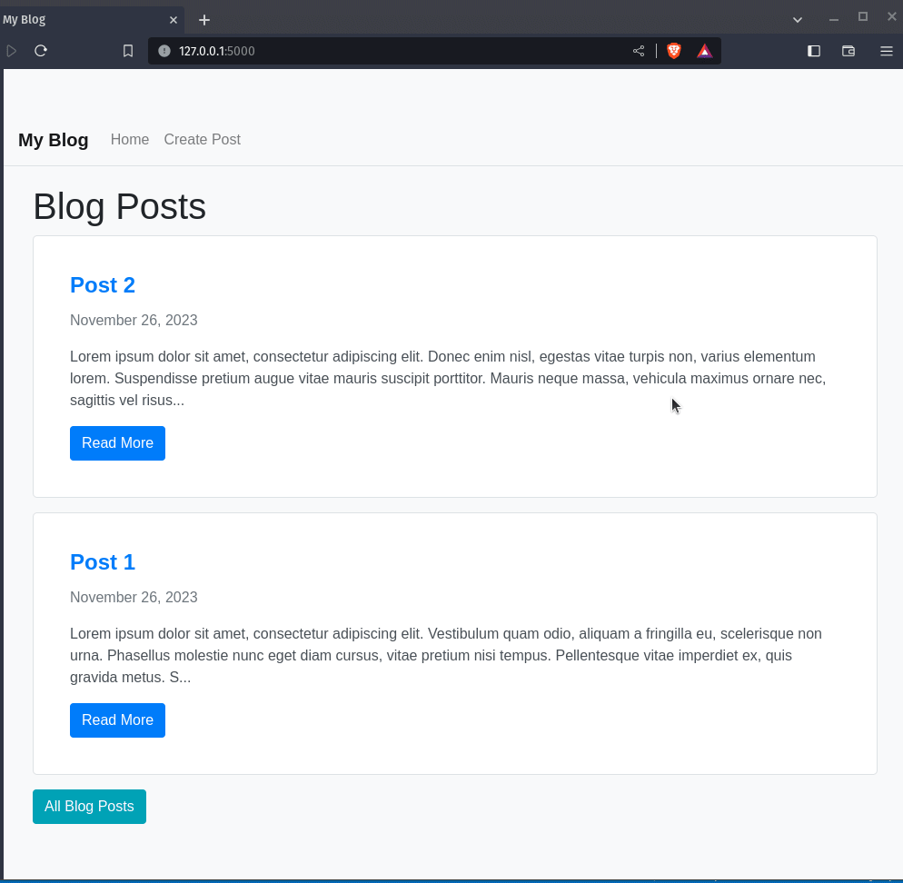

# Simple Flask Blog

## Description

This is a simple Flask blog application that allows users to create, edit, and delete blog posts. It includes basic CRUD (Create, Read, Update, Delete) operations for managing blog content. The application uses Flask for the web framework, SQLAlchemy for database management, and Flask-WTF for form handling.

### Dependencies

- Flask
- SQLAlchemy
- Flask-WTF
- markdown2 (for Markdown support)

## How It Works

This program includes the following features:

- **Home Page (`/`):** Displays a list of all blog posts, ordered by date.

- **Single Blog Post (`/post/<int:id>`):** Displays a specific blog post based on the provided ID.

- **All Blog Posts (`/posts`):** Displays a list of all blog posts with options to read, edit, and delete.

- **Create Blog Post (`/create`):** Allows users to create a new blog post. Includes a form with title and body fields.

- **Edit Blog Post (`/edit/<int:id>`):** Allows users to edit an existing blog post. Populates the form with the current post data for editing.

- **Delete Blog Post (`/delete/<int:id>`):** Deletes a specific blog post based on the provided ID.


### Run the Application

Run the Flask application with the following command:

```bash
python app.py
```

Visit `http://localhost:5000` in your web browser to access the blog.


## Program Input & Outputs

- **Inputs:**
  - When creating or editing a blog post, users input a title and body content through a form.

- **Outputs:**
  - The application renders blog posts on the home page (`/`) and individual post pages (`/post/<int:id>`).
  - Successful actions (creating, editing, or deleting a post) trigger flash messages for user feedback.



### Additional Enhancements

While this is a simple blog, consider adding the following features for further improvement:

- User authentication
- Pagination
- Categories or tags
- Markdown support
- Comments
- Search functionality
- Image upload
- Drafts
- Responsive design
- Analytics
