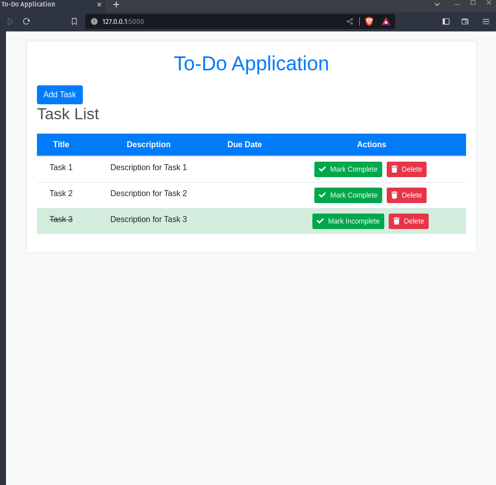

# To-Do Application

## Description

The To-Do Application is a simple web application built with Flask and SQLAlchemy that allows users to manage their tasks efficiently. Users can add new tasks, mark tasks as complete or incomplete, and delete tasks. The application provides a clean and user-friendly interface to help individuals keep track of their to-do lists.

### Technologies Used

- **Flask:** The backend framework for handling HTTP requests and rendering templates.
- **SQLAlchemy:** A SQL toolkit and Object-Relational Mapping (ORM) library used for database operations.
- **Bootstrap:** A CSS framework for styling and responsiveness.
- **FontAwesome:** Provides icons for a visually appealing interface.

## How it Works

This program includes the following features:

- **Task List Display:**
   - The main page displays a list of tasks, showing their titles, descriptions, due dates, and completion status.
   - Incomplete tasks are presented with a regular font, while completed tasks have a strikethrough effect for better visibility.

- **Task Actions:**
   - Users can mark tasks as complete or incomplete by clicking the "Mark Complete" or "Mark Incomplete" buttons.
   - Tasks can be deleted by clicking the "Delete" button, with a confirmation modal to prevent accidental deletions.

- **Add New Tasks:**
   - Users can add new tasks by clicking the "Add Task" button, which directs them to a form to input task details.


### How to Run the Application

```bash
python app.py
```

Visit `http://localhost:5000` in your web browser to access the blog.

The output of the program will look like this:



- **Explore and Manage Tasks:**
   - Navigate to the main page to view, add, and manage tasks.
   - Use the provided buttons to mark tasks as complete or incomplete and delete tasks.
   - Click the "Add Task" button to add new tasks with details.

