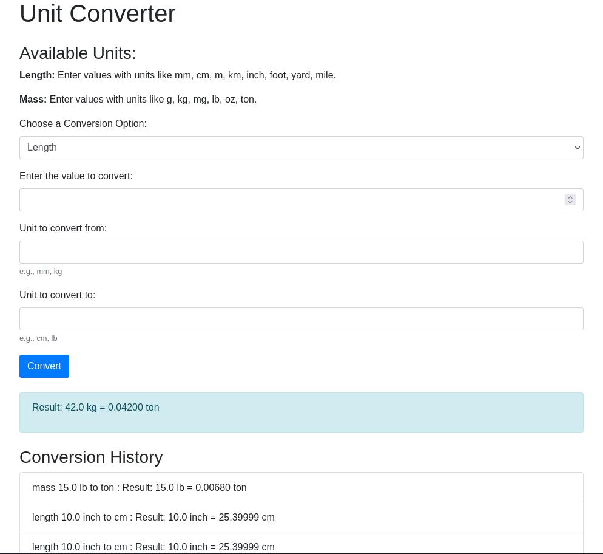

# Unit Converter

The Unit Converter is a web application built using Flask that allows users to convert values between different units of length and mass. Users can input a value, select the category (length or mass), and choose the units for conversion. The application provides instant results and maintains a history of recent conversions.

This web application is an implementation of this [Unit Converter CLI](https://github.com/joj-macho/Pythological-Playground/tree/main/converter), providing a more user-friendly interface for unit conversions.

## How It Works

1. **Choose a Conversion Category:**
   - Select either "Length" or "Mass" from the dropdown menu.

2. **Enter the Value to Convert:**
   - Input the numerical value you want to convert.

3. **Select Units for Conversion:**
   - For both "Unit to convert from" and "Unit to convert to," enter the respective units (e.g., mm, cm, kg, lb).

4. **Click "Convert":**
   - Press the "Convert" button to perform the conversion.

5. **View Results:**
   - Instantly see the result of the conversion and view the history of recent conversions below.

### Available Units

#### Length
- mm (Millimeter)
- cm (Centimeter)
- m (Meter)
- km (Kilometer)
- inch (Inch)
- foot (Foot)
- yard (Yard)
- mile (Mile)

#### Mass
- g (Gram)
- kg (Kilogram)
- mg (Milligram)
- lb (Pound)
- oz (Ounce)
- ton (Ton)

### Conversion History

The application keeps track of the last 5 conversions, displaying the category, value, units, and result. This allows users to quickly reference their recent conversions.

### How to Run the Application

```bash
python app.py
```

Visit `http://localhost:5000` in your web browser to use the Unit Converter.

The output of the program will look like this:

