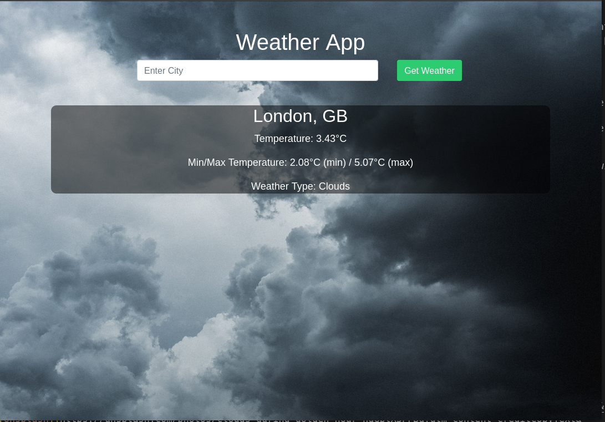
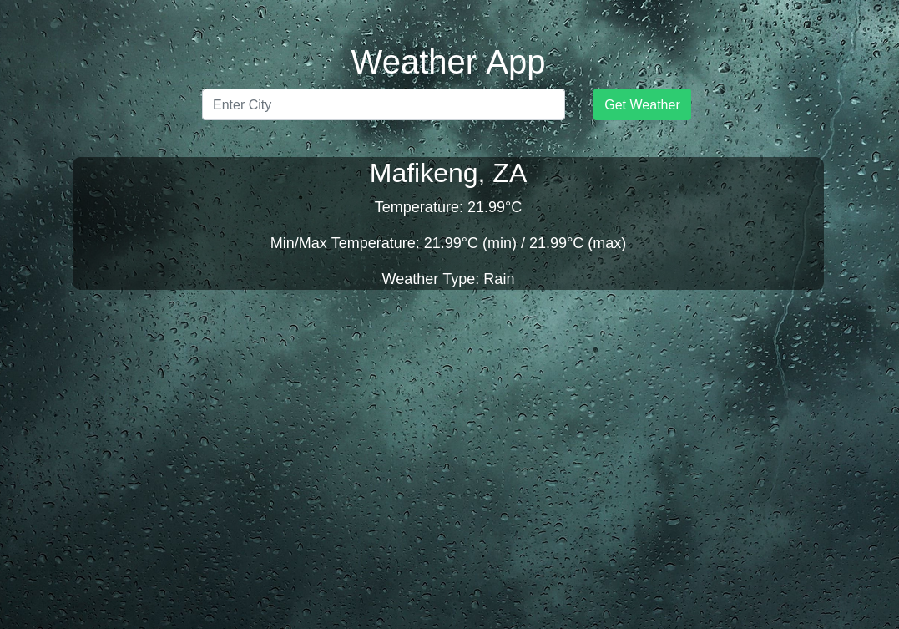
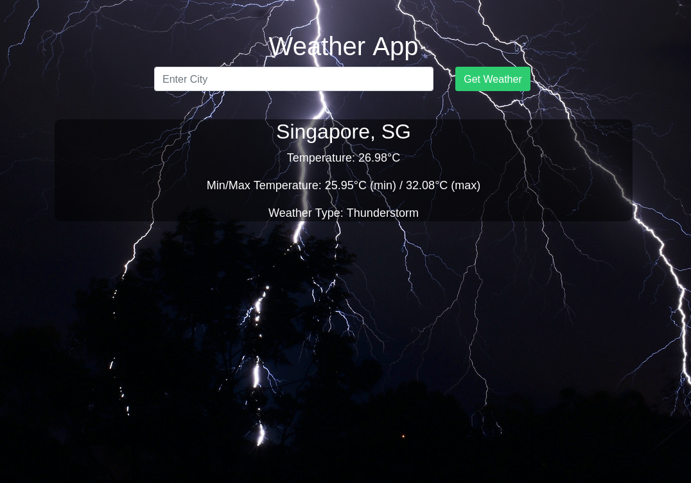
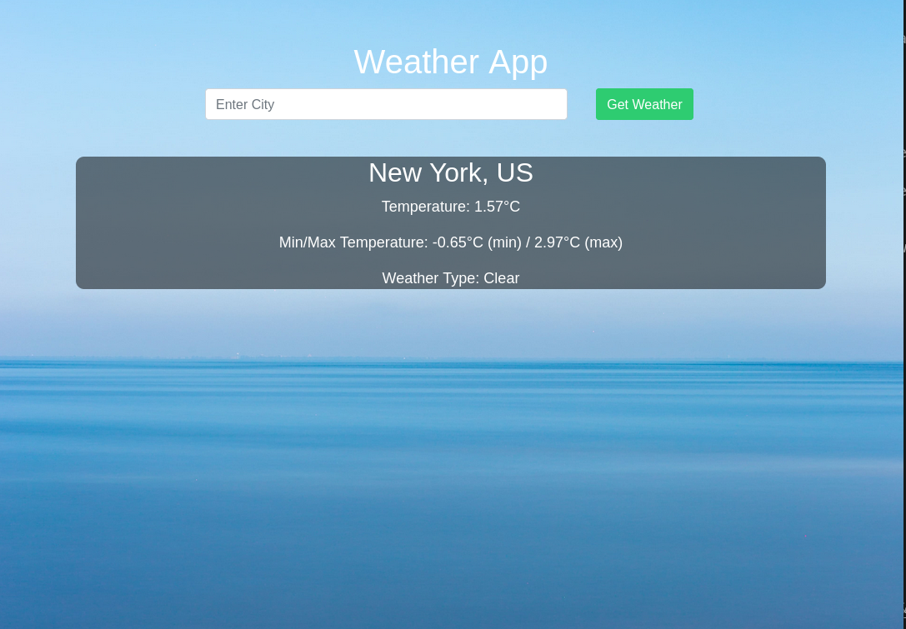

# Weather App

## Description

The Weather App is a simple Flask web application that allows users to check the current weather in a city. It uses the OpenWeatherMap API to fetch weather data and displays it alongside a background image that reflects the current weather condition.

## How It Works

- The Flask application is initialized and configured with a secret key.

- The OpenWeatherMap API key and base URL are defined as constants.

- Routes are established for the home page (`/`) and weather retrieval (`/weather`). The routes render HTML templates, allowing users to input cities and view weather information.

- Functions such as `fetch_weather` and `get_weather_image_url` handle the retrieval of weather data and mapping of weather types to image URLs.

## How to Run the Application

- Make sure you have a valid OpenWeatherMap API key.
- To run this application, make sure you have Python installed on your system.
- Ensure that Flask is installed. If not, you can install it using pip: `pip install flask`
- Navigate to the project directory.
- Run the application in the terminal: `python3 app.py`
- Open a web browser and navigate to `http://127.0.0.1:5000/` to view access the Weather App.
- Use the search bar to look for specific movies.

The output will look like this:

  
  

  
  

#### Credits for Images

- **weather-background.jpg**: Photo by [Tom Barrett](https://unsplash.com/@wistomsin?utm_content=creditCopyText&utm_medium=referral&utm_source=unsplash) on [Unsplash](https://unsplash.com/photos/clouds-during-golden-hour-hgGplX3PFBg?utm_content=creditCopyText&utm_medium=referral&utm_source=unsplash)
  
- **cloudy.jpg**: Photo by [Daoudi Aissa](https://unsplash.com/@dannyeve?utm_content=creditCopyText&utm_medium=referral&utm_source=unsplash) on [Unsplash](https://unsplash.com/photos/cumulus-clouds-Pe1Ol9oLc4o?utm_content=creditCopyText&utm_medium=referral&utm_source=unsplash)
  
- **thunderstorm.jpg**: Photo by [Michelle McEwen](https://unsplash.com/@michellem18?utm_content=creditCopyText&utm_medium=referral&utm_source=unsplash) on [Unsplash](https://unsplash.com/photos/black-and-white-abstract-painting-sCrqMG2f6qo?utm_content=creditCopyText&utm_medium=referral&utm_source=unsplash)

- **haze.jpg**: Photo by [Tobias Tullius](https://unsplash.com/@tobiastu?utm_content=creditCopyText&utm_medium=referral&utm_source=unsplash) on [Unsplash](https://unsplash.com/photos/trees-covered-with-fog-RhjVGxILcqE?utm_content=creditCopyText&utm_medium=referral&utm_source=unsplash)

- **rainy.jpg**: Photo by [Valentin Müller](https://unsplash.com/@wackeltin_meem?utm_content=creditCopyText&utm_medium=referral&utm_source=unsplash) on [Unsplash](https://unsplash.com/photos/dew-drops-on-glass-panel-bWtd1ZyEy6w?utm_content=creditCopyText&utm_medium=referral&utm_source=unsplash)

- **clear.jpg**: Photo by [Dave Hoefler](https://unsplash.com/@iamthedave?utm_content=creditCopyText&utm_medium=referral&utm_source=unsplash) on [Unsplash](https://unsplash.com/photos/blue-ocean-photography-ELXbHhzVFO0?utm_content=creditCopyText&utm_medium=referral&utm_source=unsplash)